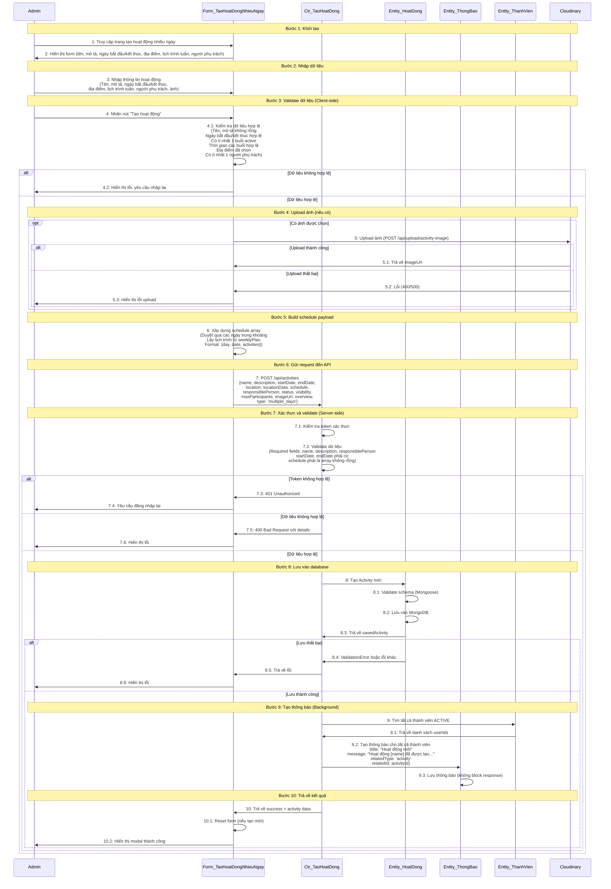

# Sơ đồ tuần tự: Tạo hoạt động nhiều ngày

## Mô tả
Sơ đồ tuần tự mô tả luồng xử lý khi Admin tạo một hoạt động nhiều ngày trong hệ thống.

## Sơ đồ UML Sequence Diagram

### Dạng Mermaid (có thể render trên GitHub, GitLab, hoặc các tool hỗ trợ Mermaid)



## Sơ đồ dạng PlantUML (cho các tool hỗ trợ PlantUML)

```plantuml
@startuml Tạo hoạt động nhiều ngày
actor Admin
boundary "Form_TaoHoatDongNhieuNgay" as Form
control "Ctr_TaoHoatDong" as Ctr
entity "Entity_HoatDong" as Entity
entity "Entity_ThongBao" as Notif
entity "Entity_ThanhVien" as Member
cloud "Cloudinary" as Cloud

== Khởi tạo ==
Admin -> Form: 1: Truy cập trang tạo hoạt động nhiều ngày
Form -> Admin: 2: Hiển thị form

== Nhập dữ liệu ==
Admin -> Form: 3: Nhập thông tin hoạt động\n(Tên, mô tả, ngày bắt đầu/kết thúc,\nđịa điểm, lịch trình tuần, người phụ trách, ảnh)

== Validate dữ liệu (Client-side) ==
Admin -> Form: 4: Nhấn nút "Tạo hoạt động"
activate Form
Form -> Form: 4.1: Kiểm tra dữ liệu hợp lệ

alt Dữ liệu không hợp lệ
    Form -> Admin: 4.2: Hiển thị lỗi, yêu cầu nhập lại
    deactivate Form
else Dữ liệu hợp lệ
    == Upload ảnh (nếu có) ==
    opt Có ảnh được chọn
        Form -> Cloud: 5: Upload ảnh\n(POST /api/upload/activity-image)
        activate Cloud
        alt Upload thành công
            Cloud -> Form: 5.1: Trả về imageUrl
        else Upload thất bại
            Cloud -> Form: 5.2: Lỗi (400/500)
            Form -> Admin: 5.3: Hiển thị lỗi upload
        end
        deactivate Cloud
    end

    == Build schedule payload ==
    Form -> Form: 6: Xây dựng schedule array

    == Gửi request đến API ==
    Form -> Ctr: 7: POST /api/activities\n{name, description, startDate, endDate,\nlocation, locationData, schedule,\nresponsiblePerson, status, visibility,\nmaxParticipants, imageUrl, overview,\ntype: 'multiple_days'}
    activate Ctr

    == Xác thực và validate (Server-side) ==
    Ctr -> Ctr: 7.1: Kiểm tra token xác thực
    Ctr -> Ctr: 7.2: Validate dữ liệu

    alt Token không hợp lệ
        Ctr -> Form: 7.3: 401 Unauthorized
        Form -> Admin: 7.4: Yêu cầu đăng nhập lại
        deactivate Ctr
        deactivate Form
    else Dữ liệu không hợp lệ
        Ctr -> Form: 7.5: 400 Bad Request với details
        Form -> Admin: 7.6: Hiển thị lỗi
        deactivate Ctr
        deactivate Form
    else Dữ liệu hợp lệ
        == Lưu vào database ==
        Ctr -> Entity: 8: Tạo Activity mới
        activate Entity
        Entity -> Entity: 8.1: Validate schema (Mongoose)
        Entity -> Entity: 8.2: Lưu vào MongoDB
        Entity -> Ctr: 8.3: Trả về savedActivity
        deactivate Entity

        alt Lưu thất bại
            Ctr -> Form: 8.4: ValidationError hoặc lỗi khác
            Form -> Admin: 8.5: Hiển thị lỗi
            deactivate Ctr
            deactivate Form
        else Lưu thành công
            == Tạo thông báo (Background) ==
            Ctr -> Member: 9: Tìm tất cả thành viên ACTIVE
            activate Member
            Member -> Ctr: 9.1: Trả về danh sách userIds
            deactivate Member
            Ctr -> Notif: 9.2: Tạo thông báo cho tất cả thành viên
            activate Notif
            Notif -> Notif: 9.3: Lưu thông báo\n(không block response)
            deactivate Notif

            == Trả về kết quả ==
            Ctr -> Form: 10: Trả về success + activity data
            deactivate Ctr
            Form -> Form: 10.1: Reset form (nếu tạo mới)
            Form -> Admin: 10.2: Hiển thị modal thành công
            deactivate Form
        end
    end
end

@enduml
```

## Các thành phần (Lifelines)

1. **Admin**: Actor - Người dùng có role CLUB_LEADER
2. **Form_TaoHoatDongNhieuNgay**: Boundary - Component React (CreateMultipleDaysActivityPage)
3. **Ctr_TaoHoatDong**: Control - API Route Handler (/api/activities POST)
4. **Entity_HoatDong**: Entity - Activity Model (MongoDB)
5. **Entity_ThongBao**: Entity - Notification Model
6. **Entity_ThanhVien**: Entity - Membership Model
7. **Cloudinary**: External Service - Dịch vụ upload ảnh

## Các luồng thay thế (Alternative Flows)

### 1. Upload ảnh thất bại
- Khi upload ảnh lên Cloudinary thất bại, quá trình dừng lại và hiển thị lỗi cho Admin

### 2. Token hết hạn
- Khi token xác thực không hợp lệ, hệ thống yêu cầu Admin đăng nhập lại

### 3. Validation lỗi ở server
- Khi dữ liệu không pass validation ở server hoặc schema validation của Mongoose, trả về lỗi chi tiết

## Điểm cần lưu ý

1. **Validation 2 lớp**: Client-side (nhanh, UX tốt) và Server-side (bảo mật, đảm bảo tính toàn vẹn dữ liệu)
2. **Upload ảnh tùy chọn**: Chỉ thực hiện nếu có selectedImage
3. **Schedule building**: Phức tạp, cần xử lý weekly plan (Mon-Sun) kết hợp với date range (startDate → endDate)
4. **Notification async**: Không block response, lỗi không ảnh hưởng đến việc tạo activity
5. **Error handling**: Nhiều điểm có thể lỗi, cần xử lý từng trường hợp cụ thể

## File code tham khảo

- Frontend: `src/app/admin/activities/create-multiple/page.tsx` (dòng 2154-2467)
- Backend API: `src/app/api/activities/route.ts` (dòng 99-276)
- Upload API: `src/app/api/upload/activity-image/route.ts`
- Model: `src/models/Activity.ts`

