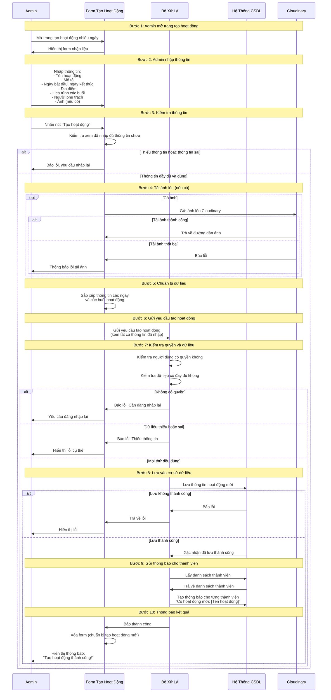

# Sơ đồ tuần tự đơn giản: Tạo hoạt động nhiều ngày

## Mô tả
Sơ đồ này mô tả các bước khi Admin tạo một hoạt động nhiều ngày trong hệ thống, được trình bày một cách đơn giản, dễ hiểu.

## Các thành phần

1. **Admin**: Người dùng có quyền tạo hoạt động (CLUB_LEADER)
2. **Form Tạo Hoạt Động**: Trang web hiển thị form để nhập thông tin
3. **Bộ Xử Lý**: Phần xử lý logic và kiểm tra dữ liệu
4. **Hệ Thống CSDL**: Nơi lưu trữ dữ liệu (hoạt động, thông báo, thành viên)
5. **Cloudinary**: Dịch vụ lưu trữ ảnh trên internet

## Sơ đồ Mermaid (Dễ hiểu)



## Sơ đồ PlantUML (Dễ hiểu)

```plantuml
@startuml Tạo hoạt động nhiều ngày - Đơn giản
actor Admin
boundary "Form Tạo Hoạt Động" as Form
control "Bộ Xử Lý" as XuLy
database "Hệ Thống CSDL" as CSDL
cloud "Cloudinary" as Cloud

== Admin mở trang ==
Admin -> Form: Mở trang tạo hoạt động nhiều ngày
Form -> Admin: Hiển thị form nhập liệu

== Admin nhập thông tin ==
Admin -> Form: Nhập thông tin hoạt động\n(Tên, mô tả, ngày, địa điểm, lịch trình, người phụ trách, ảnh)

== Kiểm tra thông tin ==
Admin -> Form: Nhấn nút "Tạo hoạt động"
activate Form
Form -> Form: Kiểm tra đã nhập đủ thông tin chưa

alt Thiếu thông tin hoặc sai
    Form -> Admin: Báo lỗi, yêu cầu nhập lại
    deactivate Form
else Thông tin đầy đủ
    == Tải ảnh (nếu có) ==
    opt Có ảnh
        Form -> Cloud: Gửi ảnh lên Cloudinary
        activate Cloud
        alt Tải thành công
            Cloud -> Form: Trả về đường dẫn ảnh
        else Tải thất bại
            Cloud -> Form: Báo lỗi
            Form -> Admin: Thông báo lỗi
        end
        deactivate Cloud
    end

    == Chuẩn bị dữ liệu ==
    Form -> Form: Sắp xếp thông tin các ngày và buổi

    == Gửi yêu cầu ==
    Form -> XuLy: Gửi yêu cầu tạo hoạt động
    activate XuLy

    == Kiểm tra quyền và dữ liệu ==
    XuLy -> XuLy: Kiểm tra quyền người dùng
    XuLy -> XuLy: Kiểm tra dữ liệu đầy đủ

    alt Không có quyền
        XuLy -> Form: Báo lỗi: Cần đăng nhập lại
        Form -> Admin: Yêu cầu đăng nhập lại
        deactivate XuLy
        deactivate Form
    else Dữ liệu thiếu
        XuLy -> Form: Báo lỗi: Thiếu thông tin
        Form -> Admin: Hiển thị lỗi
        deactivate XuLy
        deactivate Form
    else Mọi thứ đúng
        == Lưu vào CSDL ==
        XuLy -> CSDL: Lưu thông tin hoạt động mới
        activate CSDL

        alt Lưu không thành công
            CSDL -> XuLy: Báo lỗi
            XuLy -> Form: Trả về lỗi
            Form -> Admin: Hiển thị lỗi
            deactivate CSDL
            deactivate XuLy
            deactivate Form
        else Lưu thành công
            CSDL -> XuLy: Xác nhận đã lưu
            deactivate CSDL

            == Gửi thông báo ==
            XuLy -> CSDL: Lấy danh sách thành viên
            activate CSDL
            CSDL -> XuLy: Trả về danh sách
            XuLy -> CSDL: Tạo thông báo cho thành viên
            CSDL -> CSDL: Lưu thông báo
            deactivate CSDL

            == Thông báo kết quả ==
            XuLy -> Form: Báo thành công
            deactivate XuLy
            Form -> Form: Xóa form
            Form -> Admin: Hiển thị "Tạo hoạt động thành công!"
            deactivate Form
        end
    end
end

@enduml
```

## Giải thích từng bước (Dễ hiểu)

### Bước 1: Mở trang
- Admin vào trang web để tạo hoạt động
- Hệ thống hiển thị form để nhập thông tin

### Bước 2: Nhập thông tin
- Admin điền các thông tin cần thiết:
  - Tên hoạt động (ví dụ: "Hội thao mùa xuân")
  - Mô tả (ví dụ: "Tổ chức các trò chơi vận động")
  - Ngày bắt đầu và ngày kết thúc
  - Địa điểm tổ chức
  - Lịch trình các buổi trong tuần (Thứ 2 sáng, Thứ 3 chiều, ...)
  - Chọn người phụ trách
  - Tải ảnh minh họa (nếu có)

### Bước 3: Kiểm tra thông tin
- Khi Admin nhấn nút "Tạo hoạt động", hệ thống kiểm tra:
  - Đã nhập đủ thông tin chưa?
  - Ngày kết thúc có sau ngày bắt đầu không?
  - Có chọn ít nhất 1 buổi hoạt động không?
  - Có chọn ít nhất 1 người phụ trách không?

### Bước 4: Tải ảnh (nếu có)
- Nếu Admin có chọn ảnh, hệ thống gửi ảnh lên Cloudinary
- Cloudinary lưu ảnh và trả về đường dẫn ảnh
- Nếu tải ảnh thất bại, báo lỗi cho Admin

### Bước 5: Chuẩn bị dữ liệu
- Hệ thống sắp xếp lại thông tin:
  - Tính toán các ngày trong khoảng từ ngày bắt đầu đến ngày kết thúc
  - Với mỗi ngày, lấy lịch trình tương ứng (Thứ 2 → lịch Thứ 2, Thứ 3 → lịch Thứ 3, ...)
  - Gộp thông tin thành một danh sách các ngày và buổi hoạt động

### Bước 6: Gửi yêu cầu
- Form gửi tất cả thông tin đã nhập lên server để xử lý

### Bước 7: Kiểm tra quyền và dữ liệu
- Server kiểm tra:
  - Người dùng có quyền tạo hoạt động không? (phải là CLUB_LEADER)
  - Dữ liệu có đầy đủ và đúng định dạng không?

### Bước 8: Lưu vào cơ sở dữ liệu
- Nếu mọi thứ đều đúng, server lưu thông tin hoạt động vào database
- Nếu lưu thành công, tiếp tục bước 9
- Nếu lưu thất bại, báo lỗi cho Admin

### Bước 9: Gửi thông báo cho thành viên
- Server lấy danh sách tất cả thành viên trong CLB
- Tạo thông báo cho mỗi thành viên: "Có hoạt động mới: [Tên hoạt động]"
- Lưu thông báo vào database (thành viên sẽ thấy khi đăng nhập)

### Bước 10: Thông báo kết quả
- Server báo cho Form biết đã tạo thành công
- Form xóa sạch các thông tin đã nhập (để Admin có thể tạo hoạt động mới)
- Hiển thị thông báo "Tạo hoạt động thành công!" cho Admin

## Các trường hợp lỗi thường gặp

### 1. Thiếu thông tin
- **Nguyên nhân**: Admin chưa nhập đủ các thông tin bắt buộc
- **Giải pháp**: Hệ thống báo lỗi cụ thể, Admin bổ sung thông tin và thử lại

### 2. Ngày không hợp lệ
- **Nguyên nhân**: Ngày kết thúc trước ngày bắt đầu
- **Giải pháp**: Hệ thống báo lỗi, Admin sửa lại ngày

### 3. Tải ảnh thất bại
- **Nguyên nhân**: Ảnh quá lớn hoặc lỗi kết nối
- **Giải pháp**: Admin có thể chọn ảnh khác hoặc bỏ qua ảnh

### 4. Không có quyền
- **Nguyên nhân**: Tài khoản không phải CLUB_LEADER hoặc đã hết phiên đăng nhập
- **Giải pháp**: Đăng nhập lại hoặc liên hệ quản trị viên

### 5. Lưu database thất bại
- **Nguyên nhân**: Lỗi kết nối database hoặc dữ liệu không đúng định dạng
- **Giải pháp**: Hệ thống báo lỗi, Admin thử lại sau

## Lưu ý

- Tất cả các bước đều được thực hiện tự động, Admin chỉ cần nhập thông tin và nhấn nút
- Nếu có lỗi ở bất kỳ bước nào, quá trình sẽ dừng lại và báo lỗi cho Admin
- Thông báo cho thành viên được tạo tự động sau khi hoạt động được lưu thành công
- Admin có thể tạo nhiều hoạt động liên tiếp, mỗi lần tạo xong form sẽ được xóa sạch


